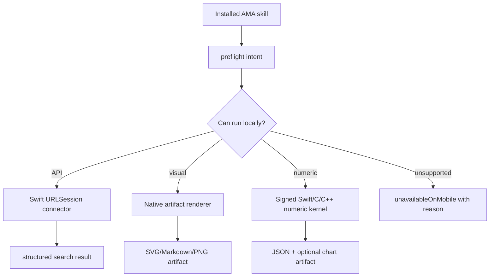

# iOS Local Execution Research

Date: 2026-05-24

## Question

Can AMA make API-search, visual artifact, and MATLAB-like scientific skills run locally on iOS instead of staying as preflight/deferred skills?

## Baseline Constraints

Apple App Review guideline 2.5.2 requires apps to be self-contained in their bundles and prevents downloading, installing, or executing code that introduces or changes app functionality. Guideline 2.5.6 requires web-browsing apps to use WebKit and WebKit JavaScript. This means AMA can execute code that is shipped in the signed app bundle or exposed by approved native frameworks, but should not install arbitrary skill-provided scripts as executable programs after installation.

Python's official iOS documentation says Python on iOS must be embedded in a native app, with the interpreter, standard library, and Python code packaged in the app bundle. This supports a narrow bundled-runtime option, but it does not support arbitrary post-install skill scripts as mobile plugins.

MathWorks documents two different mobile paths:

- MATLAB Mobile connects to a MATLAB session running in MathWorks Cloud, so it is not local/offline execution.
- MATLAB Coder can generate C code from MATLAB algorithms and integrate that code into an iPhone or iPad app through Xcode. This is local execution, but only for code-generation-compatible algorithms.

## Feasibility Matrix

| Area | Local iOS feasibility | Recommended path | Not recommended |
| --- | --- | --- | --- |
| API search | High | Native Swift connectors using `URLSession`, credentials in AMA secret storage, skill-level routing through host intents | Browser automation, shell `curl`, Python/Node SDKs inside skills |
| Visual artifacts | Medium-high | Native artifact renderer using Markdown documents, SVG, SwiftUI, Swift Charts, Core Graphics, ImageIO, Vision where useful | Running LaTeX, binary document generation, Python/matplotlib, PowerPoint automation, desktop office tooling |
| MATLAB-like numeric execution | Medium for selected algorithms, low for general MATLAB | MATLAB Coder-generated C/C++ modules wrapped by Swift, plus Swift-native math kernels for common operations | Full MATLAB engine, arbitrary `.m` execution, GNU Octave as a general skill runtime |
| Python scientific stack | Low for broad stack, medium for fixed embedded subset | Only if a curated Python runtime and all allowed Python code ship in the app bundle | Installing packages or executing arbitrary plugin scripts post-install |
| WASM/JS kernels | Medium for deterministic bundled kernels | WebKit/WKWebView or JavaScriptCore for bundled, sandboxed kernels with limited native bridge | Downloaded wasm/plugins that change app capability after review |

## API Search Implementation Path

This is now the first implemented web/API execution track because it is closest to AMA's existing architecture and does not require a foreign runtime.

Use the native connector layer under AMA:

- `AMASkillScientificWebAPISearchRequest`
- `AMASkillScientificWebResearchFetching`
- `AMASkillURLSessionScientificWebResearchFetcher`
- provider adapters for OpenAlex, Crossref, PubMed, Semantic Scholar, and Exa first, then Imaging Data Commons, PrimeKG, and local metadata search where possible

Expose through host intents:

- `scientific.web_api_search`
- `scientific.paper_lookup` and `scientific.research_lookup` as provider-specific expansions
- `scientific.dataset_lookup` as a later data connector expansion

Keep `scientific.web_api_preflight`, but change successful cases from "ready" to actual connector invocation. Credentials must stay in AMA secret storage. Each external lookup should require explicit user approval unless the skill is configured as a trusted source.

## Visual Artifact Implementation Path

This should be the second implementation track. The realistic local artifact surface is:

- PNG/JPEG export through `UIGraphicsImageRenderer`, Core Graphics, and ImageIO.
- Markdown document export for chart specs, reports, and text-first slide/poster drafts.
- Charts through Swift Charts for common line, bar, scatter, area, histogram-style, and simple 3D chart needs.
- Schematic/diagram rendering through a small AMA-native scene model, rendered by SwiftUI/Core Graphics.
- Presentation-like output as Markdown page decks first. Real editable PPTX is not a good first mobile target unless a dedicated OpenXML writer is added.

Expose through host intents:

- `scientific.chart_render`
- `scientific.schematic_render`
- `scientific.poster_write_markdown`
- `scientific.slide_deck_write_markdown`
- `scientific.image_export`

The renderer should accept a constrained JSON scene/chart spec, not arbitrary code. That makes the skill result reproducible, testable, and App Store-safe.

## MATLAB-like Implementation Path

Do not attempt a general local MATLAB or Octave runtime first.

The viable local path is a compiled-kernel model:

1. Identify common MATLAB skill operations that users actually need on mobile:
   - matrix arithmetic
   - FFT/filtering/signal summaries
   - simple ODE solving
   - interpolation/regression
   - basic plotting
2. Implement these as Swift-native kernels using Accelerate/BNNS where appropriate.
3. For user-owned MATLAB algorithms that must run on device, require a build-time conversion pipeline:
   - MATLAB source is checked for MATLAB Coder compatibility on desktop.
   - MATLAB Coder generates C/C++.
   - The generated code is compiled into an AMA Swift Package/XCFramework.
   - AMA exposes it as a signed host intent.

This does not satisfy arbitrary `.m` script execution. It satisfies product-safe execution of approved numerical kernels on iOS.

## Proposed AMA Architecture

## Implemented First Slice

AMA now has first local iOS execution slices for API search, visual artifacts, and MATLAB-like numeric tracks:

- `scientific.web_api_search`
  - Swift `URLSession` host intent for `openalex`, `crossref`, `pubmed`, `semantic_scholar`, and `exa`.
  - Requires `userApprovedExternalLookup=true` before any network call.
  - OpenAlex supports public query execution and optional `apiKey`/`email`; credential and email query evidence is redacted.
  - Crossref supports public work metadata search and optional `email`; email query evidence is redacted.
  - PubMed supports NCBI ESearch/ESummary public metadata search; optional `apiKey` and `email` evidence is redacted.
  - Semantic Scholar supports Academic Graph paper search; optional `apiKey` evidence is redacted.
  - Exa requires `apiKey`; missing credentials return structured `needs_credentials` without making a network call.
  - Returns normalized result records and reports `local_scripts_executed=false`.

- `scientific.numeric_eval`
  - Swift-native numeric kernel for `summary`, `dot`, `transpose`, `matrix_multiply`, `linear_regression`, `fft_real`, `moving_average`, `linear_interpolate`, and `ode_euler_linear`.
  - The FFT path is a bounded real-input Swift DFT for small mobile-safe vectors; the ODE path is a first-order linear forward-Euler kernel, not arbitrary equation execution.
  - Returns structured JSON with `local_scripts_executed=false` and `matlab_or_python_interpreter=false`.
- `scientific.chart_render_svg`
  - Swift-native SVG renderer for constrained `line`, `scatter`, and `bar` chart specs.
  - Persists an `image/svg+xml` artifact through AMA's artifact context.
- `scientific.chart_render_markdown`
  - Swift-native Markdown document renderer for the same constrained `line`, `scatter`, and `bar` chart specs.
  - Persists a `text/markdown` artifact through AMA's artifact context and returns byte-count evidence.
- Plugin availability marker
  - A skill that mentions MATLAB/Python conversion can remain mobile-available only when it declares `ama-mobile-native-execution: true`.
  - A skill directory that contains `scripts/`, `.py`, `.m`, `.sh`, `.ps1`, `.bat`, `.js`, `.ts`, `.r`, executable files, or equivalent external runtime assets is still installed as unavailable on mobile.

This is intentionally not arbitrary MATLAB/Python execution. It is a product-safe replacement path where skills route common scientific work to signed AMA host intents.

## Recommended Phases

1. API search local execution
   - Implemented first provider slice: `scientific.web_api_search` for OpenAlex, Crossref, PubMed, Semantic Scholar, and Exa.
   - `scientific-web-research` skills now call `run_intent` for supported providers instead of source repository scripts.
   - Next expansion: add dataset providers such as IDC/PrimeKG.
   - Add offline/network-failure UI proof after the app has a user-facing retry surface for this intent.

2. Visual artifact local renderer
   - Implemented first as constrained SVG chart rendering and Markdown chart document generation through `scientific.chart_render_svg` and `scientific.chart_render_markdown`.
   - Next expansion: PNG renderer, richer chart layouts, and nonblank artifact checks.

3. MATLAB-like numeric kernels
   - Implemented as Swift-native `scientific.numeric_eval` for matrix/vector/stat summary, linear regression, bounded FFT/DFT, moving average filtering, linear interpolation, and first-order linear ODE Euler operations.
   - Next expansion: one selected MATLAB Coder generated-code bridge packaged as a signed Swift package or XCFramework.
   - Arbitrary `.m` execution remains blocked.

## Verification Evidence

- AMA package focused tests:
  - `swift test --filter 'scientificLocalExecution|installSkillPluginAllowsNativeMobileReplacementForExternalRuntimeText'`
  - Result: passed. This proves the Swift numeric/chart host intents and the plugin availability override for native replacements.
  - `swift test --filter scientificLocalExecutionRunsNumericKernelsAndRendersChartArtifacts`
  - Result: passed after adding FFT, moving average, interpolation, ODE, SVG chart artifact, and Markdown chart document artifact coverage to the host-intent test.
  - `swift test --filter 'scientificMobilePreflightRoutesWebArtifactAndDeferredSkills|scientificLocalExecutionRunsNumericKernelsAndRendersChartArtifacts'`
  - Result: passed. This proves the Swift API-search, numeric, chart, and mobile preflight host intents, including OpenAlex search, Crossref search, PubMed ESearch/ESummary search, Semantic Scholar paper search, Exa credential gating, approval gating, and credential redaction.
- AMASample local AMA bridge:
  - `swift test --filter scientificLocalExecution`
  - Result: passed. This proves the synced local package exposes the same host intent behavior in the sample bridge.
  - `swift test --filter scientificLocalExecutionRunsNumericKernelsAndRendersChartArtifacts`
  - Result: passed after syncing AMA into AMASample. This proves the expanded numeric kernels and Markdown chart document renderer are present in the sample's local AMA package.
  - `swift test --filter scientificMobilePreflightRoutesWebArtifactAndDeferredSkills`
  - Result: passed after syncing AMA into AMASample. This proves the web/API search intent is present in the sample's local AMA package.
- AMASample iOS simulator:
  - `bash scripts/generate.sh`
  - `xcodebuild test -scheme AMASampleService -workspace /Users/axient/repoAgent/AMASample/App.xcworkspace -destination 'platform=iOS Simulator,name=iPad (A16),OS=26.4.1' -only-testing AMASampleServiceTests -derivedDataPath /tmp/AMASampleScientificLocalExecutionDerivedData`
  - Result: `** TEST SUCCEEDED **`, 25 Swift Testing tests passed. The `ama-skills-host-scientific-local-execution` scenario verified Swift matrix execution, SVG chart artifact creation, and no local scripts.
  - `xcodebuild test -scheme AMASampleService -workspace /Users/axient/repoAgent/AMASample/App.xcworkspace -destination 'platform=iOS Simulator,name=iPad (A16),OS=26.4.1' -only-testing AMASampleServiceTests -derivedDataPath /tmp/AMASampleScientificNumericKernelsDerivedData`
  - Result: `** TEST SUCCEEDED **`, 25 Swift Testing tests passed. The local execution scenario verified the expanded Swift numeric kernel availability text for FFT/interpolation/ODE in AMASample. Result bundle: `/tmp/AMASampleScientificNumericKernelsDerivedData/Logs/Test/Test-AMASampleService-2026.05.24_14-59-43-+0900.xcresult`.
  - `xcodebuild test -scheme AMASampleService -workspace /Users/axient/repoAgent/AMASample/App.xcworkspace -destination 'platform=iOS Simulator,name=iPad (A16),OS=26.4.1' -only-testing AMASampleServiceTests -derivedDataPath /tmp/AMASampleScientificWebAPISearchKeyDerivedData`
  - Result: `** TEST SUCCEEDED **`, 25 Swift Testing tests passed. The mobile preflight scenario verified OpenAlex Swift search, Exa credential gating, artifact renderer gating, desktop blocking, and no local scripts.
  - `xcodebuild test -scheme AMASampleService -workspace /Users/axient/repoAgent/AMASample/App.xcworkspace -destination 'platform=iOS Simulator,name=iPad (A16),OS=26.4.1' -only-testing AMASampleServiceTests -derivedDataPath /tmp/AMASampleScientificCrossrefDerivedData`
  - Result: `** TEST SUCCEEDED **`, 25 Swift Testing tests passed. The mobile preflight scenario verified OpenAlex Swift search, Crossref Swift search, Exa credential gating, artifact renderer gating, desktop blocking, and no local scripts. Result bundle: `/tmp/AMASampleScientificCrossrefDerivedData/Logs/Test/Test-AMASampleService-2026.05.24_15-10-23-+0900.xcresult`.
  - `xcodebuild test -scheme AMASampleService -workspace /Users/axient/repoAgent/AMASample/App.xcworkspace -destination 'platform=iOS Simulator,name=iPad (A16),OS=26.4.1' -only-testing AMASampleServiceTests -derivedDataPath /tmp/AMASampleScientificPubMedDerivedData`
  - Result: `** TEST SUCCEEDED **`, 25 Swift Testing tests passed. The mobile preflight scenario verified OpenAlex Swift search, Crossref Swift search, PubMed ESearch/ESummary search, Exa credential gating, artifact renderer gating, desktop blocking, and no local scripts. Result bundle: `/tmp/AMASampleScientificPubMedDerivedData/Logs/Test/Test-AMASampleService-2026.05.24_15-17-29-+0900.xcresult`.
  - `swift test --filter scientificMobilePreflightRoutesWebArtifactAndDeferredSkills`
  - Result: passed in AMA and AMASample local AMA package after adding Semantic Scholar. This proves `semantic_scholar` routes through Swift `URLSession`, returns normalized `paper_id`/DOI/arXiv/open-access PDF fields, redacts `x-api-key`, and executes no local scripts.
  - `xcodebuild test -scheme AMASampleService -workspace /Users/axient/repoAgent/AMASample/App.xcworkspace -destination 'platform=iOS Simulator,name=iPad (A16),OS=26.4.1' -only-testing AMASampleServiceTests -derivedDataPath /tmp/AMASampleScientificSemanticScholarDerivedData`
  - Result: `** TEST SUCCEEDED **`, 25 Swift Testing tests passed. The mobile preflight scenario verified OpenAlex Swift search, Crossref Swift search, PubMed ESearch/ESummary search, Semantic Scholar Swift search, Exa credential gating, artifact renderer gating, desktop blocking, and no local scripts. Result bundle: `/tmp/AMASampleScientificSemanticScholarDerivedData/Logs/Test/Test-AMASampleService-2026.05.24_15-28-25-+0900.xcresult`.
  - `xcodebuild test -scheme AMASampleService -workspace /Users/axient/repoAgent/AMASample/App.xcworkspace -destination 'platform=iOS Simulator,name=iPad (A16),OS=26.4.1' -only-testing AMASampleServiceTests -derivedDataPath /tmp/AMASampleScientificMarkdownChartDerivedData`
  - Result: `** TEST SUCCEEDED **`, 25 Swift Testing tests passed. The local execution scenario verified Swift matrix execution, SVG chart artifact creation, Markdown chart document artifact creation, and no local scripts. Result bundle: `/tmp/AMASampleScientificMarkdownChartDerivedData/Logs/Test/Test-AMASampleService-2026.05.24_15-55-50-+0900.xcresult`.
- Scientific plugin static executable scan:
  - `find /Users/axient/repoAgent/skillsPlugin/plugins/scientific-* -type f \( -name '*.py' -o -name '*.sh' -o -name '*.ps1' -o -name '*.bat' -o -name '*.js' -o -name '*.ts' -o -name '*.m' -o -name '*.r' -o -perm -111 \) -print | wc -l`
  - Result: `0`.

4. Optional embedded runtime research spike
   - Prototype embedded Python only as a signed, bundled, read-only runtime.
   - Do not let installed skills add Python packages or scripts after app review.
   - Compare binary size, App Store risk, crash isolation, and reproducibility against Swift-native kernels before adopting it.

## Verdict

There is a real path forward, but it is not "make desktop scripts run on iOS." The product-quality approach is to convert executable capability into signed AMA host intents:

- API search: proceed now with Swift connectors.
- Visual artifacts: proceed with the implemented native JSON-to-SVG renderer and Markdown document artifact generator, then add PNG and richer scene renderers.
- MATLAB-like execution: proceed only as Swift-native kernels and MATLAB Coder-generated compiled modules; keep arbitrary MATLAB/Octave scripts unavailable on mobile.

## Sources

- Apple App Review Guidelines: https://developer.apple.com/app-store/review/guidelines/
- Python on iOS: https://docs.python.org/3.13/using/ios.html
- MATLAB Coder iPhone and iPad support: https://www.mathworks.com/hardware-support/iphone-matlab-coder.html
- MATLAB Mobile: https://kr.mathworks.com/products/matlab-mobile.html
- Apple Machine Learning and AI frameworks: https://developer.apple.com/machine-learning/
- Swift Charts: https://developer.apple.com/documentation/Charts
- Core Graphics: https://developer.apple.com/documentation/coregraphics
- Accelerate: https://developer.apple.com/accelerate/
- JavaScriptCore: https://developer.apple.com/documentation/javascriptcore
- WKWebView: https://developer.apple.com/documentation/webkit/wkwebview
- OpenAlex Works API: https://developers.openalex.org/api-reference/works/list-works
- Crossref REST API filters: https://www.crossref.org/documentation/retrieve-metadata/rest-api/rest-api-filters/
- NCBI E-utilities: https://dataguide.nlm.nih.gov/eutilities/utilities.html
- Exa Search API: https://exa.ai/docs/reference/search
